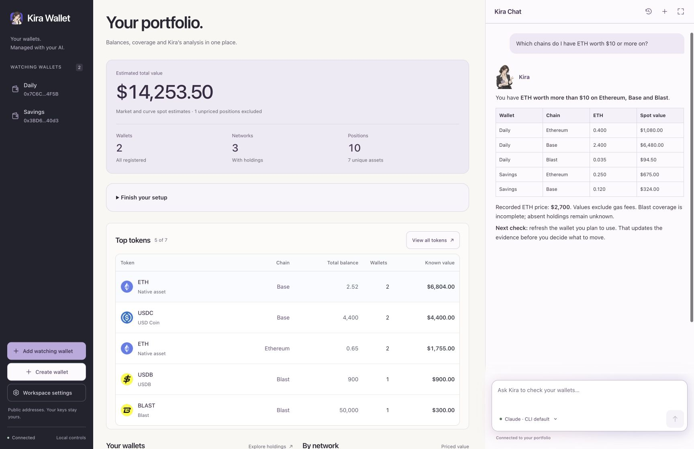
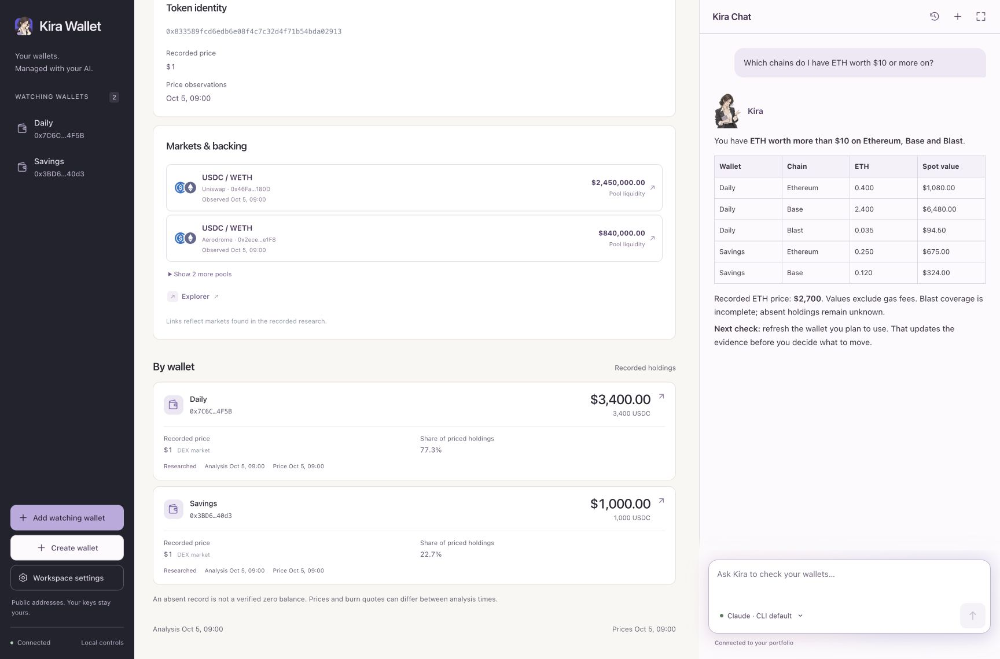

<p align="center">
  
</p>

<h1 align="center">Kira Wallet</h1>
<p align="center"><strong>Manage your wallets. With your own AI.</strong></p>
<p align="center">
  <a href="https://kirawallet.app">Website</a> ·
  <a href="https://github.com/realproject7/kira-wallet/releases">Releases</a> ·
  <a href="docs/CLI.md">CLI guide</a>
</p>

Bring the AI you already use to your wallets. Add public wallet addresses, see
what you hold across supported EVM chains, and ask Kira to research your tokens
or refresh your holdings. Kira runs on your computer and uses your existing
Codex or Claude Code account.



## Get started

**Requires Node.js 22+ and Python 3.11+. macOS is verified.** The research and
background-process features require a POSIX environment.

Install Kira:

```sh
npm install -g kira-wallet
kira setup
```

Open the local app at [127.0.0.1:8787](http://127.0.0.1:8787).

After your first setup, open Kira with:

```sh
kira start
```

It starts your local app and opens the browser. Use `kira stop` to stop it.
For a viewer without wallet or research actions, use `kira start --read-only`.

Prefer an archive? [GitHub releases](https://github.com/realproject7/kira-wallet/releases/tag/v0.1.2)
include the same package and its checksum.

1. **Set up discovery.** In **Workspace settings**, connect an indexer for broad
   ERC20 discovery. Public RPC alone has limited discovery; incomplete coverage
   stays visible. An AI or browser wallet connection does not enable an indexer.
2. **Add a watching wallet.** Paste a public address and give it a name. Add more
   wallets whenever you need them. Without discovery, the form explicitly
   offers limited research of native and Mint Club assets.
3. **Connect your AI.** Install and sign in to the
   [Codex CLI](https://developers.openai.com/codex/cli) or
   [Claude Code](https://code.claude.com/docs/en/quickstart), then choose your
   account from **Connect a model** in Kira Chat. Select one wallet or your whole
   portfolio, test the connection, and choose whether to allow research tools.
4. **Ask Kira.** Start with a question, or ask it to refresh a wallet's holdings
   or prices. Follow the job in **Activity** while it runs.

Want to look around first? Try the demo:

```sh
kira --data-dir /tmp/kira-demo demo --port 8790
```

Open [127.0.0.1:8790](http://127.0.0.1:8790). Stop it with
`kira --data-dir /tmp/kira-demo stop`.

## What can I ask?

- “Which chains do I have ETH worth $10 or more on?”
- “Find tokens I may have overlooked. Show their quantity, recorded price,
  market venues and any available full-balance exit quote.”
- “Review my Blast holdings across all my wallets. What is known, and where
  is coverage missing?”
- “Compare my saved analyses. What changed?”
- “Refresh prices for my daily wallet, then tell me what the job actually found.”

Kira can read approved records, compare saved analyses, and start holdings or
price research when you enable its wallet tools. It distinguishes recorded spot
value from an execution quote. Missing prices and holdings stay unknown;
transfer inactivity needs transfer-history evidence. Testnets and pool liquidity
are excluded from your portfolio's USD value.



*Markets, paired token logos and each wallet's balance in one view.*

## Your wallets, your controls

- **Watch an existing wallet** using its public address. Watching does not grant
  Kira permission to spend.
- **Create an OWS wallet** with **Create wallet** in the sidebar, powered by
  [Open Wallet Standard](https://openwallet.sh/).
  Enter the encryption passphrase in the local form. Kira connects the public
  EVM account; keys stay in the local OWS vault.
- **Choose what AI can see.** Wallet access can be off, limited to one wallet,
  or cover your portfolio. Approved context is sent through your selected
  native CLI and model account. Their data policies still apply.
- **Keep records locally.** No Kira account or hosted portfolio database is
  required. Chat drafts stay in memory; saving Kira chat history is opt-in.

Chat currently handles research and wallet records. Signing, transfers and trade
execution are not implemented. [Wallet onboarding details](docs/CLI.md#browser-and-local-ows-wallets).

## Useful commands

```sh
kira add <public-address> --tag 'Daily wallet'
kira refresh 'Daily wallet'
kira prices 'Daily wallet'
kira status
kira stop
```

Data defaults to `~/.local/share/kira-wallet`, separate from the installed
package. Use `--data-dir /absolute/private/directory` before a command to choose
another workspace. For connection, model or provider help, see the
[CLI guide](docs/CLI.md) and [viewer guide](viewer/README.md).

From 0.1.4, a partial wallet analysis explains disabled discovery, missing
credentials and network failures directly beside the holdings. After connecting
discovery, use **Refresh holdings** to create a new analysis. **Refresh prices**
does not discover missing tokens. Existing workspace provider settings and
published snapshots are preserved.

## Build and contribute

```sh
npm install --ignore-scripts
node bin/kira.cjs setup
npm test
python3 scripts/check-public.py
```

From source, use `node bin/kira.cjs` in place of `kira`.
[Local AI tool setup](docs/AGENT_TOOLS.md) ·
[Release preparation](docs/RELEASE.md).

Original code and Kira character assets are available under the [MIT license](LICENSE).
Third-party artwork and references retain their own terms; see
[Third-party notices](THIRD_PARTY_NOTICES.md).

### Token coverage and optional Alchemy setup

Kira uses free public RPC with bounded fallback and checks a selected common-token
list alongside native assets and Mint Club. Other ERC20 holdings can be missing.
Incomplete results show recovery guidance on Home and the wallet page. Connect
your own Alchemy account for broader discovery on supported networks, then
refresh holdings. Public RPC remains the first choice for ordinary reads;
Alchemy is a backup and supplies the dedicated token inventory API. See the
[step-by-step Alchemy guide](docs/ALCHEMY_SETUP.md) and
[RPC behavior](docs/FREE_RPC.md).
