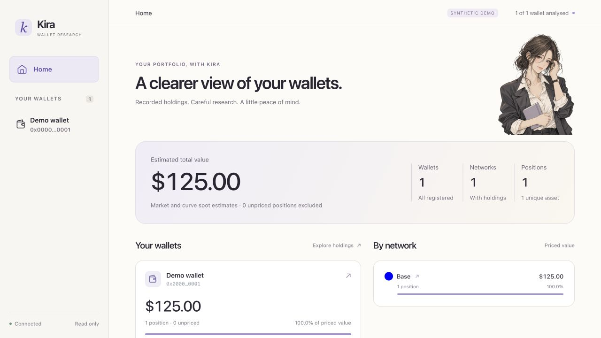

# Kira Wallet local development delivery

Completed on 2026-10-03. This is a locally verified development build.
No package, repository or website was published.

## Delivered

The working read-only viewer now uses the approved adult webtoon Kira, warm
ivory surfaces, ink typography and violet accents. Home, wallet, token and
network routes keep one compact breadcrumb. Kira's contextual notes are
derived from recorded statistics and explain valuation gaps. Existing filters,
search, token and chain artwork, source links and local file polling remain.

The CLI packages the Python research engine, browser assets and pinned viem
dependency. Installed assets and private runtime data use separate directories.
Public RPC works without an operator credential file. Custom RPC stores
environment references, validates chain identity and uses public fallback only
when explicitly enabled. Indexed discovery is configured separately. CLI
initialization, analysis, resume, price refresh and viewer lifecycle are exposed
through `kira`.

The isolated concept studio uses synthetic data. It previews Home, wallets,
networks, exact token identities, contextual notes, character comparison and
explicitly simulated analysis states. The approved character is its default.
Original generated images, identity anchors and exact generation prompts are
recorded. Toony's identity-lock workflow informed the process; no Toony source,
models or artwork were imported.

The next agent-session milestone has a local protocol research note. It is a
contract review, without a login or connected model session.

## Verification

| Check | Result and scope |
| --- | --- |
| `npm test` | Passed 14 engine/configuration tests and 18 viewer tests, Node cache/outage/endpoint checks and viewer JavaScript syntax |
| Additional Node checks | Passed pipeline, on-chain engine, curve-price refresh and prototype JavaScript syntax |
| `python3 scripts/check-install.py` | Passed fresh npm pack/install with operator environment removed; public-only configuration, synthetic demo, image route, private-path denial, start reuse, wrong-portfolio rejection, stop and status; 28 archive entries |
| Public RPC samples | 17 JSON-RPC methods across Ethereum, Base and Blast; bytecode and limited historical reads passed on reachable endpoints; an unavailable Ethereum endpoint was followed by the verified PublicNode fallback |
| Live viewer browser QA | Home, wallet, network and token navigation; exact token route; All/5/10 filters; combined search; keyboard skip and valuation disclosure; single breadcrumb |
| Responsive browser QA | Live Home at 375 and 320 pixels; token and wallet details; prototype Home and mobile Kira notes; no document overflow in checked views |
| Local update continuity | Synthetic price changed from 1.25 to 1.50 and back; displayed total changed from 125 to 150 and back without browser reload |
| Preservation | All 682 original runtime JSON files unchanged; production API response bytes equal the original model baseline |
| Distribution privacy | Explicit package allowlist; operator registry, snapshots, settings, caches, logs, private screenshots and handoffs excluded; staged files and final archive checked before the local commit |

The tested host used Node 24.18.0, npm 11.16.0 and Python 3.14.6 on macOS.
No full registry scan, whole-wallet reanalysis or production price refresh was
performed during this foundation run. Confidential optional test wallets were
not used, registered or copied into project artifacts.

## Reviewable artifacts

- `docs/KIRA_IDENTITY.md`: voice, adult character anchors and state mapping.
- `docs/character/generation.json` and `webtoon-generation.json`: exact prompts
  and built-in image generation provenance. No seed reproducibility is claimed.
- `viewer/static/kira.png`: approved base portrait used by the live viewer.
- `prototype/`: synthetic concept studio and retained original alternatives.
- `docs/CLI.md`: public/custom RPC, discovery and lifecycle instructions.
- `docs/AGENT_ADAPTER_RESEARCH.md`: observed Codex contract and next job ticket.
- `docs/screenshots/`: synthetic screenshots safe for design review.
- `scripts/check-install.py`: repeatable clean-install acceptance check.



## Local use

The operator's existing portfolio remains at `http://127.0.0.1:8765/#/home`.
The synthetic viewer is at port 8790 and concept studio at port 8792 while their
local servers are running. Runtime data belongs outside the package and remains
private. The source checkout can be used directly:

```sh
npm install --ignore-scripts
node bin/kira.cjs init
node bin/kira.cjs doctor
node bin/kira.cjs start --port 8787
```

Use global `--data-dir` before the command to select a private portfolio.
The source README describes adding an operator-supplied address and exact tag.
The existing portfolio uses an explicit private compatibility import; that file
is not a required product default.

## Limits and next work

Browser writes, persisted jobs, connected chat, onboarding and snapshot
comparison remain later milestones. Extra character expressions and poses are
also pending. Current contextual notes come from deterministic recorded data.
Public RPC samples do not establish complete token discovery, broad archive
support or actual multicall execution. Full analysis has no global request cap
yet. Provider billing could not be determined and is not reported as zero.

Only macOS was verified. POSIX locks and process checks still need a deliberate
cross-platform strategy. The package remains private and unlicensed pending the
operator's open-source license choice. Independent release review and external
user validation remain required before publication.

The next productive planning step is the versioned persisted job envelope and
typed engine operation contract. It must preserve partial results and keep
duplicate requests, engine cancellation and model interruption distinct.

[Selected design evidence](https://www.lazyweb.com/agentic-search/d4bd1497-9716-4312-95b7-f3834ebf2481)
informed the layout and companion placement. It is not evidence of market demand.
