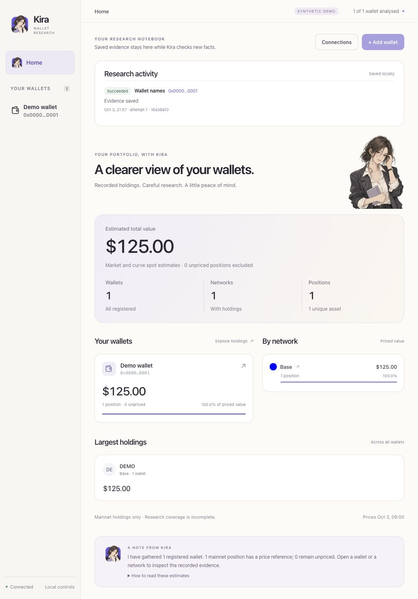

# Kira durable workspace delivery

Completed locally on 2026-10-03 as private development build 0.1.0-dev.2.
The continuation reached the operator account-connection gate. Connected chat,
publication and independent release review remain pending.

## Delivered behavior

CLI and opt-in browser controls share versioned typed requests and persisted
jobs. Same-key retries return one job. Saved work survives a worker restart;
unfinished engine work requires explicit resume. Published partial results
remain available and cannot be resumed over their immutable analysis. Failure
and cancellation preserve the previous published result and saved evidence.
Cancellation terminates the engine process group, including descendants.
A worker lease survives a supervisor crash while its engine is still active.

Analysis publication reconciles the registry/manifest crash boundary without
rerunning providers. Price jobs keep an immutable overlay before replacing the
viewer projection; restart can finish that projection without provider calls.
Recorded stages retain actual counts, endpoint identity references and decimal
pinned blocks. Model interruption is separate from engine cancellation.

The browser provides wallet registration, exact names, holdings and price
refresh, stop/resume, saved analysis comparison and separate RPC/discovery
references. Host, Origin, session, content type and request-size checks protect
local actions. Session tokens rotate with the server. The usual launch stays
read-only; `--controls` explicitly enables actions. The primary local instance
now has controls enabled. Synthetic demo research cannot contact providers.

The first-wallet screen and connection forms keep unknown values visible.
Comparison preserves decimal quantities, chain/contract identity and absent
records as unknown. It reports balance, reference and coverage differences;
it does not attribute USD changes or compare historical price-overlay values.

The local read-only MCP adapter exposes eight typed tools through `kira tools`.
It reads recorded facts and jobs without a login, model turn, shell tool or
provider request. Its stdio transcript and packaged runtime are verified;
live client attachment is not yet verified.

Kira's new original character icon appears in the brand home link, Home button,
notes, empty state, wallet dialog and concept studio. Browser and touch icons
are installed. A tiny editable notebook mark complements the adult portrait.
Built-in imagegen produced the master and cleaned its transparent exterior.
[Exact prompts and provenance](character/brand-generation.json) are saved.

## Verification evidence

| Check | Result and scope |
| --- | --- |
| `npm test` | Passed 41 engine/configuration/job/tool tests and 24 viewer/HTTP tests, Node cache/outage checks and both viewer JavaScript syntax checks |
| Node syntax | Passed pipeline-onchain.cjs, onchain.cjs and prototype/app.js |
| `python3 scripts/check-install.py` | Passed fresh npm pack/install without operator configuration; logo route, read-only lifecycle, protected controls, actual synthetic names job and stdio tool facts |
| Durable process cases | Passed supervisor SIGKILL recovery with one engine invocation; cancellation stopped a SIGTERM-resistant descendant and preserved prior evidence; publication won a simultaneous cancellation |
| Browser interaction | Passed actual synthetic names mutation and completion; saved analysis comparison displayed 100 -> 120 with exact delta 20; invalid onboarding address blocked before submission; connection settings separated RPC from discovery |
| Responsive and keyboard | Checked desktop, 320 px Home/wallet/history and 375 px add form; no document overflow; Escape closes dialogs and returns to the trigger |
| Preservation | All 682 original runtime JSON hashes unchanged; primary portfolio `/api/state` bytes unchanged across upgrade |
| Privacy | Source/package allowlists and audit exclude operator registry, snapshots, settings, jobs, logs, authentication and real portfolio screenshots |
| Independent review / model access | Not performed; no account connection, live Codex/MCP-client attachment, model turn or release claim |

All research tests used synthetic portfolios and local subprocesses. No new
operator wallet, holdings refresh, price refresh or additional JSON-RPC probe
was performed in this continuation.

## Open the result

Primary local workspace: `http://127.0.0.1:8765/#/home`.
Synthetic control preview: `http://127.0.0.1:8793/#/home` while its server runs.
The empty first-launch preview used a separate private directory at port 8794.
The original concept studio remains available at port 8792 while running.

## Operator boundary and limits

The operator must choose an approved account/authentication route and consent
to the portfolio scope before connected Kira chat. The current official
[app-server guide](https://developers.openai.com/siwc/token-sharing-open-source/codex-app-server)
describes app-owned OAuth handling. This does not establish this account's
eligibility or billing. The [tool guide](AGENT_TOOLS.md) records the concrete
setup boundary. No desktop authentication files were copied or used.

Independent security/release review, platform testing beyond macOS, a global
provider-call cap and an external pilot remain outstanding. Legacy direct
engine scripts keep their earlier interfaces; immutable price history is
provided by the durable CLI/browser job path. Read-only model tools do not
automatically connect a client. Full connected chat and session persistence
remain future work after account setup. This package remains private and
unlicensed. No remote, PR, merge, main push, package publication or deployment
was created.

[Selected design evidence](https://www.lazyweb.com/agentic-search/b98ba70d-d7d2-408b-b6b0-f529201e4365)
informed the per-job state and recovery UI. It is not a growth or demand claim.
