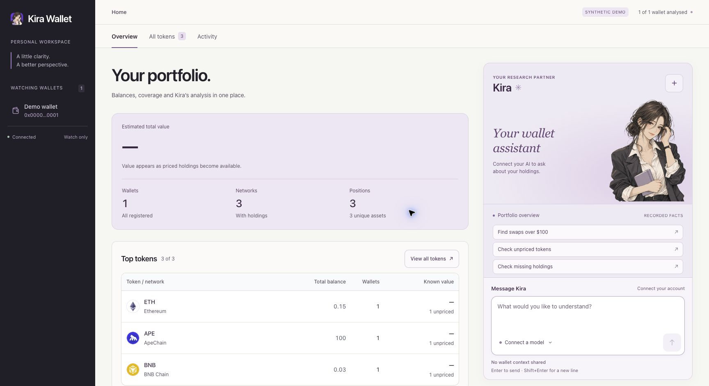
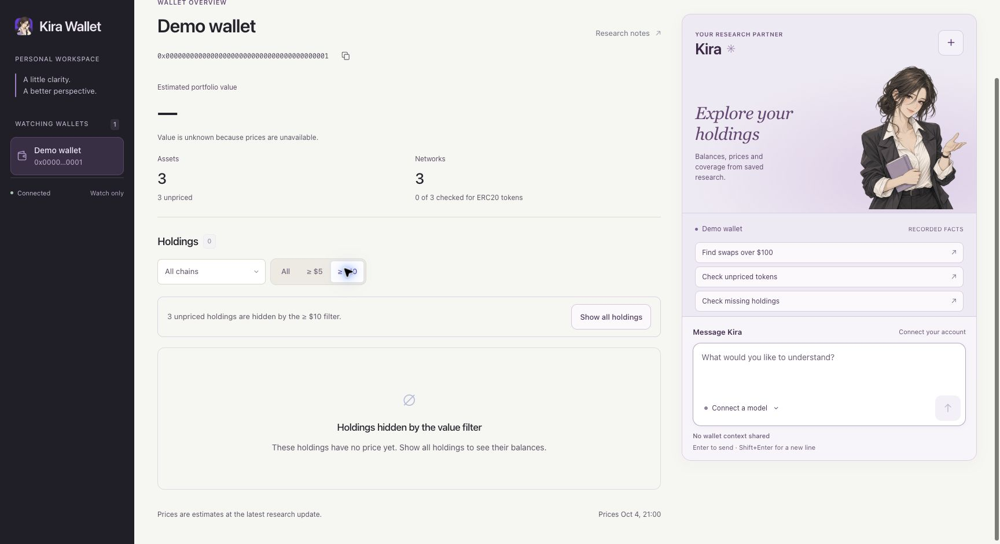
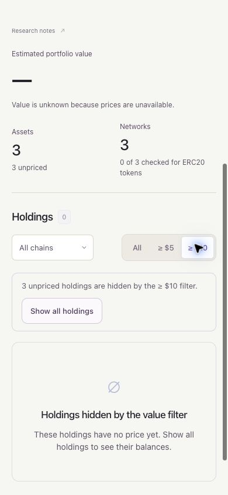

# Native price, artwork and unknown-value fix

Issue: [13](https://github.com/realproject7/kira-wallet/issues/13).

## Cause

The source comparison from `d9adfe4` to UI integration `e54304e` is empty for
`wallet.py`, `viewer/model.py`, `viewer/token_images.py`, `viewer/refresh_prices.py`
and `kira_config.py`. The UI refinement did not replace those paths.

Fresh data directories start with public RPC and no indexer. Existing portfolios
can have custom RPC and Alchemy references, which a new data directory deliberately
does not inherit. Public RPC can return native balances while broad ERC20 discovery
remains incomplete. The initial pipeline extracted native USD prices from indexer
results; a separate price refresh already queried Base WETH for ETH. Native artwork
was explicitly unset. These behaviors are present in foundation commit `e481b27`.

The old wallet total also converted entirely unknown values to zero, and a saved
$10 filter hid all unpriced positions. That combined state looked like a failed or
empty portfolio. Restoring the existing connection references and running the
unchanged engine verified the configuration difference before adding a fallback.
Private evidence and portfolios are excluded from this report.

## Change

Initial analysis keeps Alchemy native references and fills missing mainnet prices
from a public CoinGecko batch. The batch uses explicit native coin IDs, with no
wallet address or credentials. ETH, APE and BNB are included. Unknown identities,
invalid numbers and quotes outside the freshness window remain unknown. Testnets
never contribute USD totals. Price refresh preserves the established Base WETH DEX
priority for ETH. Failed providers preserve prior prices and their original times.

Native artwork uses the same explicit currency identities. Existing ERC20/Mint Club
images continue to use chain and contract identity. Known currency/network artwork
is a fallback, and missing images retain symbols. The browser makes no price-provider
or RPC requests. Image-cache failure does not block valid price publication.

Entirely unknown wallet and network totals now show a dash. New installations use
All holdings. Existing saved filters remain selected, but explicitly explain hidden
unpriced holdings and offer Show all holdings. Coverage identifies ERC20 checks,
which are separate from native balance reads. No layout redesign, trading, signing,
liquidation quotes or automatic ERC20 discovery is added.

## Verification

- The complete test suite passes, including native identity, invalid/stale/future
  quotes, original Alchemy/DEX source priority, cache failure, balances preserved
  by price jobs, and unknown-value/filter recovery.
- A clean synthetic installation passes with 63 archive members.
- Browser checks use synthetic ETH, APE and BNB. All three native logos load;
  unknown totals remain unknown; the dollar filter explains hidden balances;
  Show all holdings restores the three rows.
- At 390 pixels, the notice and its action fit without page overflow.
- Public screenshots below contain only synthetic data. The website is unchanged.

Reference evidence: [Portfolio filter recovery](https://www.lazyweb.com/agentic-search/5c8352f4-be12-4d12-b5bc-9b7e0487011c).
Native provider schema: [CoinGecko markets](https://docs.coingecko.com/reference/coins-markets).
Publication of the prepared npm package remains operator-only.
