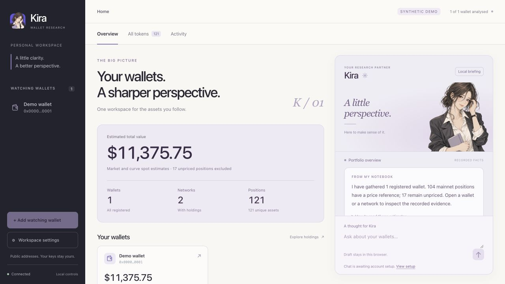
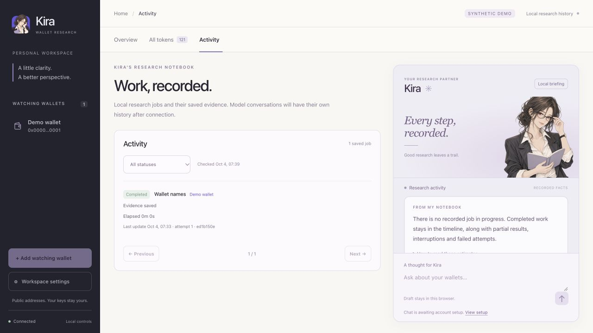

# Kira workspace redesign

Development build 0.1.0-dev.3, 2026-10-04.

## Result and design concept

The prior dashboard hid research interaction below the portfolio. The new
workspace makes Kira a persistent research partner beside the recorded evidence.
Ink navigation, warm paper, restrained lavender and editorial scene captions
give the character a coherent setting. Kira changes pose with the task instead
of remaining a decorative image on every screen.

Lazyweb product evidence informed the separated navigation, persistent partner
panel and distinct activity history. Reviewed patterns included Intercom's
dashboard hierarchy, OpenAI's logs tabs and sigmamind's analytics/activity views.
These references guided layout decisions; no reference screenshots or third-party
UI assets are redistributed.

Four new transparent illustrations extend the existing original Kira identity:
researching, explaining, reviewing and checking incomplete evidence. The
existing notebook portrait remains the welcome state. Character provenance and
exact generation prompts are in [workspace-generation.json](character/workspace-generation.json).



## Delivered behavior

- The brand returns Home. There is no duplicate sidebar Home button.
- Overview, All tokens and Activity have distinct tabs. Wallet selection stays
  in the sidebar; add/settings controls stay together; wallet-specific actions
  stay above the selected wallet.
- Kira's deterministic briefing, evidence shortcuts and conversation draft sit
  in the main section. Mobile has a direct Portfolio/Kira switch. Drafts stay
  in that browser's local storage. Sending stays disabled until the account
  route and portfolio disclosure scope are approved and implemented.
- All tokens reuses recorded chain-plus-contract aggregates. It provides
  search, network/pricing filters, sorting, explicit testnet inclusion and
  50-row pagination. Unpriced and partly unpriced assets stay visible as unknown.
  The catalog does not contact providers.
- Active work has a compact strip linked to Activity. Full job history has
  status filters, 20-row pagination, recorded stages and existing stop/resume
  controls. Queued, running, completed, partial, interrupted, failed and stopped
  states have distinct labels. Cancellation requests say Stopping until the
  engine records an outcome.
- New attempts record optional `started_at`. Timers show actual elapsed time
  for these attempts and stop on terminal updates. Old jobs say Since request.
  Queued jobs show their latest waiting interval. Missing timestamps say Unknown.
  After a minute without a stage update, the UI states that it is awaiting an
  update. A disconnected API shows the last recorded state and stops its spinner.
  Neither condition fabricates completion or failure.
- Synthetic demo sessions also reject resuming a saved provider research job.
  Names/settings jobs and existing same-origin session protections remain intact.

## Verification

Verification uses synthetic data. `npm test` passed 66 Python tests, Node cache
and outage checks, catalog/lifecycle checks and browser-source syntax. The suite covers the engine, local
HTTP controls, cache/outage behavior and browser-source syntax. Catalog checks
use 5,002 tokens and cover bounded pages, identity, unknown/partial prices,
testnets, ordering and unchanged source evidence. Lifecycle checks cover all
states, quiet stages, disconnection, cancellation and current-attempt timing.

Browser checks exercised a 122-token synthetic portfolio with 121 mainnet tokens:
50-row paging, search, unpriced filtering, token/network navigation, brand Home,
wallet selection, saved analyses, settings, keyboard dismissal/focus return,
local draft persistence and a real local names job completing through the worker.
All seven job states were inspected using private fixtures, then removed before
submitting a control action. No provider research ran during browser validation.
Desktop 1280x720 and mobile 375x812/320x700 layouts had no document overflow;
the Kira composer remained visible. Browser warnings/errors were empty.

The clean install check passed with 51 archive members. It packs and installs in an isolated directory, serves all
new assets, verifies private paths remain unavailable and executes only a
synthetic names job. Verification results are recorded in the PR.

Only the existing viewer was restarted for the operator portfolio. The
projection was byte-identical across restart, and all 682 baseline private
runtime files retained their hashes. Existing controls stayed enabled. No
operator names, holdings, snapshots, credentials or research jobs were edited.



## Publication and rollback

Public code, comments and documentation use synthetic examples. A public-history
check excludes runtime files, known operator portfolio identifiers, personal
paths, loaded secrets and credential patterns. Images also received a visual
privacy check. Public commits use a GitHub noreply identity. Private local
history and session handoffs are not pushed.

The `kira-workspace-v1` tag preserves the previous UI with a clean public
foundation history. To restore just that interface while keeping the current
backwards-compatible server and job timing support:

```sh
git restore --source=kira-workspace-v1 -- viewer/static/index.html viewer/static/app.js viewer/static/jobs.js viewer/static/style.css
```

Reload the browser. This changes tracked UI source only. Runtime portfolio
files are outside that command. Restore those UI files from the redesign branch
to return to this edition. The original pre-redesign branch also remains local.

## Limits and next work

Pagination bounds the catalog DOM and image work. The existing API still loads
the full recorded projection, and client filtering/sorting scans that catalog.
The 5,002-token test establishes behavior, not a performance guarantee for
arbitrary portfolios. Tens of thousands of positions would warrant server
pagination/indexing and a separate measured change.

Activity reflects durable job evidence, not a worker heartbeat. A long silent
stage can remain running; the UI makes that uncertainty explicit. Recovery is
an engine decision. No stale operator job was altered during redesign.

Connected model chat remains behind the existing account/session and disclosure
gates. Watching wallet connection is the agreed next capability direction.
Transfers, swaps and OWS Managed wallets require separate design and verification;
see [wallet capability direction](WALLET_CAPABILITIES.md). No connection, signing,
wallet creation or trading capability ships in this change.

This build needs independent review before merge or release. No production
deployment, registry publication or npm publication is part of this work.
