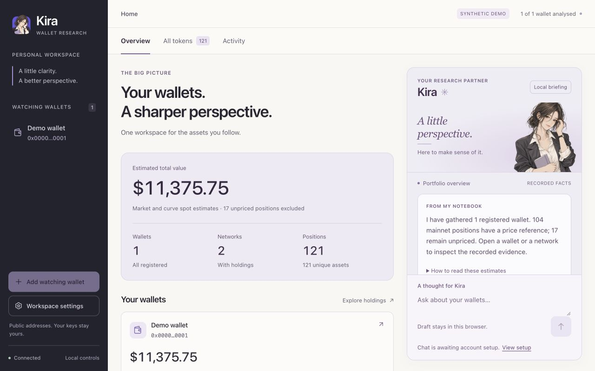

# Workspace review and visual refinement

2026-10-04. PR #2, inherited head `1577b80`, public base `e481b27`.

## Review scope and findings

The resumed session reviewed the inherited change before authoring corrections.
The scope was the PR diff, its catalog/job models, protected demo operations,
active context documents and synthetic browser behavior. The unrelated local
foundation branch was not used as the public review base. Startup branch, HEAD
and clean working tree matched the handoff. No independent GitHub approval or
merge is claimed. Verification of the corrections below is builder validation.

| Priority | Finding at inherited head | Resolution |
| --- | --- | --- |
| P2 | With Kira selected on mobile, a section or wallet route could change while its evidence stayed hidden. | Explicit navigation and hash changes reveal Portfolio. Same-route section clicks are covered. Selecting Kira reveals its composer through normal page scrolling. |
| P2 | `Name: A to Z` sorted symbols rather than token names. | Sort full names with a symbol fallback; synthetic cases use names and symbols in opposite order. |
| P2 | Supporting content dropped to 6–10px and several captions used low-contrast colors. Mobile settings and send controls were only 29–31px. | A shared type scale, darker secondary text, 44px principal controls and consistent SVGs replace the shrinking overrides. |

Catalog paging still bounds rendering rather than API loading. Activity remains
persisted evidence rather than a worker heartbeat. Those documented limitations
remain accurate; no financial totals, job states or provider outcomes were
changed by the refinements.

## Design evidence and implementation

Lazyweb's Coinbase My assets screen informed the asset/value hierarchy and
consistent icon boxes. Apple's empty-bag and account-menu screens informed the
restrained title tracking, readable supporting copy and equal-height actions.
These are visual references, not measured specifications for their CSS.
No third-party screenshots or assets are redistributed.

[Apple's button guidance](https://developer.apple.com/design/human-interface-guidelines/buttons)
also supports consistent adjacent control sizes. Kira retains its system UI
font, paper/ink/lavender surfaces and original character illustrations.

- Body and briefing: 14px, with 1.5–1.65 line height. Supporting descriptions:
  12px. Small scene/category labels: 10–11px, used only for short captions.
- Headings: 29–42px by viewport, 1.2 line height and approximately -0.035em
  tracking. Numerical totals use tabular figures and restrained tracking.
- Main controls: 44px minimum height, centered 18px icons and an 8px gap.
  Smaller 16px navigation arrows share the same SVG stroke and alignment.
- The narrow layout moves to a Portfolio/Kira switch before the two desktop
  panes become cramped. Inputs use 16px on mobile; wallet actions wrap in two
  equal columns. Dialog close buttons retain an accessible name when icon-only.
- `workspace.css` is organized by component and breakpoint rather than stacked
  minified overrides, so future refinements have a coherent source.

## Validation

`npm test` passed 41 engine/contract and 25 viewer tests, the Node cache/outage
checks, the 5,002-token catalog/lifecycle checks and browser source syntax.
The name-sort regression case passed. The isolated install check passed with
51 archive members and synthetic data only.

Browser verification uses the synthetic review portfolio. It covers desktop and
narrow layouts, navigation from Kira (including the same route), wallet/detail
views, catalog paging/search/pricing, the disabled model composer, local draft
persistence, Activity filtering and a real synthetic wallet-name job. Settings
and names dialogs retain 44px close controls, Escape dismissal and focus return.
No credential form, model session, provider request or operator-wallet mutation
is part of this verification.

Final checks at 1280×720, 1280×800, 1600×900, 375×812 and 320×700 found no
document overflow. The composer stayed visible after selecting Kira, including
at 320×700. Principal settings and send controls measured 44px; their SVGs
measured 18px and 20px. Catalog search, unknown values and 50-row paging stayed
intact. Browser warnings/errors were empty.

Additional synthetic evidence: [mobile overview](screenshots/kira-refinement-mobile.jpg),
[Kira panel](screenshots/kira-refinement-kira.jpg),
[catalog](screenshots/kira-refinement-catalog.jpg) and
[Activity](screenshots/kira-refinement-activity.jpg).

Public-history results are recorded with the PR.
Account/session selection and portfolio disclosure still require
operator decisions. The next scoped outcome is the
[Watching connection ticket](WATCHING_CONNECTION_TICKET.md).
