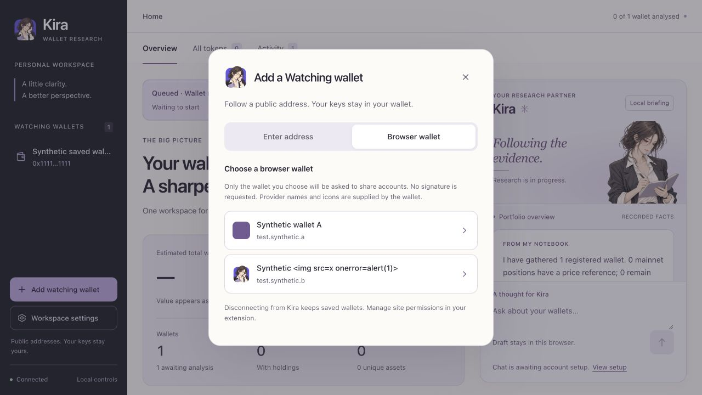
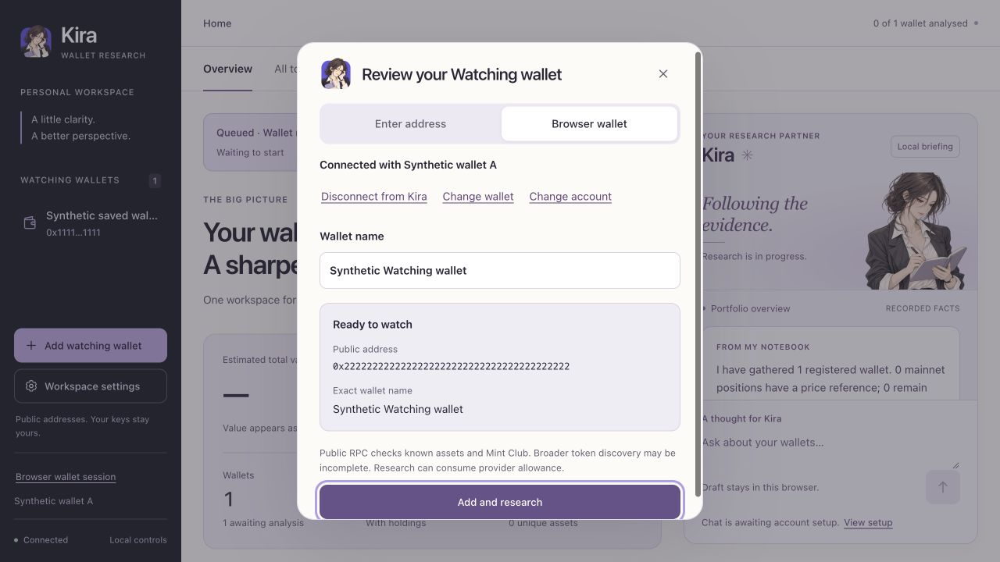
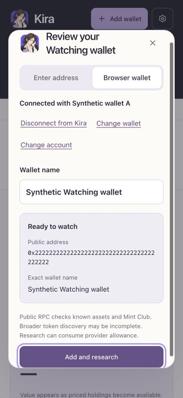

# Watching connection implementation

Status: [draft PR #3](https://github.com/realproject7/kira-wallet/pull/3), builder
verification complete. Independent review and operator extension
acceptance remain pending. This change is stacked on workspace PR #2 at
`b95d4707be5b7dd3c061a86b4a2ca3c47625a307`. It has no merge or release approval.

## Result

The add-wallet dialog now offers manual address entry or a browser wallet.
EIP-6963 announcements populate an explicit provider chooser without requesting
accounts. Only a clicked provider receives `eth_requestAccounts`. One shared
account still needs explicit selection. Completed choices collapse into a review
with the full public address and exact wallet name before Add and research.
Accepted jobs open Activity while registration and research proceed.

Provider metadata is self-reported, bounded and displayed as text. Icons accept
bounded image data URIs through `img`; remote icons fall back locally. The CSP
allows data images while script and connect sources remain restricted to self.
The browser fixture verified that an SVG onload payload did not execute and an
HTML-like provider name remained text.

Connection state stays in memory. Account changes invalidate the selected
address and require another choice, even for an identical account list. Empty
accounts, disconnect, cancelled requests and provider changes invalidate pending
responses. A chain event only updates displayed session context. No signing,
transaction, network-switch or automatic account request is implemented.

Closing a completed dialog clears its preview but keeps the session until
explicit disconnect. The sidebar can reopen that session without requesting
accounts again. Disconnect releases Kira listeners; extension permissions are
managed in the extension. Saved wallets, exact names and analyses remain intact.
Events after explicit submission cannot rewrite the captured durable job input.

Registration uses the existing session-protected same-origin operation API,
idempotency key and worker lock. A saved address offers an open-wallet link and
cannot silently rename the wallet through this form. Demo allows form exploration
but neither account requests nor research. A browser with no compatible extension
offers manual entry. The current operator viewer and portfolio were not changed
by this isolated implementation.

## Verification

- `npm test`: 41 engine tests, 26 viewer tests, 15 Watching lifecycle tests,
  existing RPC/cache tests, the 5,002-token workspace fixture and syntax checks.
- `python3 scripts/check-install.py`: fresh packed install and lifecycle using
  synthetic data. Both Watching assets are packaged and served.
- Browser fixture: no request on discovery or reload; explicit account choice;
  full-address and exact-name preview; account-change invalidation; network
  context without a new request; rejection; cancellation and late response;
  duplicate-address protection; unavailable browser; demo request/write block;
  one accepted durable job per confirmation, double-click suppression and spaces
  in the exact name preserved. Accepted registration opens Activity.
- Responsive checks: 1,280 by 720, 375 by 812 and 320 by 700. No document or
  address-preview horizontal overflow. Controls are at least 44 px, chooser
  glyphs are 18 px and narrow-screen inputs are 16 px. Escape returns focus to
  Add wallet; reopening the session does not request accounts again.
- DOM text-contrast audit of the chooser and review found no low-contrast
  ordinary text. Disabled, hidden and decorative elements were excluded.

Two inherited test-fixture issues surfaced in the fresh worktree. The HTTP test
now uses its temporary portfolio instead of relying on an ignored local registry.
The supervisor-restart test now waits for its asserted chain event to be durable
before killing the supervisor. No runtime engine or recovery logic was changed.

The private fixture command is `python3 scripts/watching-preview.py`. It creates
temporary synthetic data, announces fake providers and never launches a research
worker. `--demo` covers the server's demo block. The fixture scripts are not
packaged or served by the normal viewer.

## Evidence and remaining acceptance

[Lazyweb OpenSea and Zora references](https://www.lazyweb.com/agentic-search/489014fd-0df9-41f9-aa0d-eabfc2d5536b)
informed selectable rows, contained dialogs and progressive disclosure. Kira's
existing system font, spacing, 44 px controls and 18 px glyph system are retained.
The provider contracts follow [EIP-6963](https://eips.ethereum.org/EIPS/eip-6963)
and [EIP-1193](https://eips.ethereum.org/EIPS/eip-1193).

Independent review must inspect the generation guard, event subscriptions,
untrusted metadata and final registration boundary. The operator must check a
real extension in a supported browser, including its native approval, multiple
accounts, locking and disconnect behavior. Synthetic verification does not
establish that live acceptance passed. Model account connection and portfolio
disclosure remain separate gates. See [the remaining stages](KIRA_NEXT_STEPS.md).
